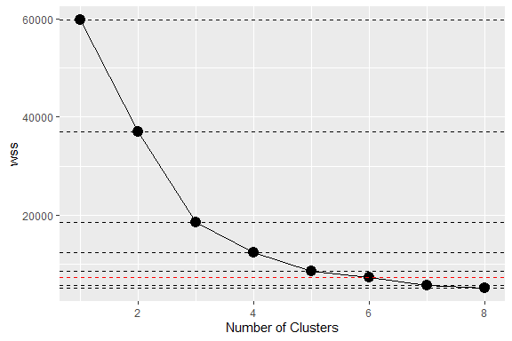

Business Intelligence Lab Submission Markdown
================
Lumin
04/11/23

- [Student Details](#student-details)
- [Setup Chunk](#setup-chunk)
- [1: Install and Load Required
  Packages](#1-install-and-load-required-packages)
- [2. Load the Dataset](#2-load-the-dataset)
- [3. Check for Missing Data and Address
  it](#3-check-for-missing-data-and-address-it)
- [4.Perform EDA and Feature
  Selection](#4perform-eda-and-feature-selection)
- [5. Create the clusters using the K-Means Clustering
  Algorithm](#5-create-the-clusters-using-the-k-means-clustering-algorithm)
- [6. Add the cluster number as a label for each
  observation](#6-add-the-cluster-number-as-a-label-for-each-observation)

# Student Details

<table style="width:99%;">
<colgroup>
<col style="width: 32%" />
<col style="width: 63%" />
<col style="width: 3%" />
</colgroup>
<tbody>
<tr class="odd">
<td><strong>Student ID Numbers and Names of Group Members</strong></td>
<td colspan="2"><pre><code>                                                                                                 |</code></pre>
<ol type="1">
<li>112827 - A - Mungai Kenneth | |</li>
<li>123324 - B - Kelly Noella Sota | |</li>
<li>134265 - A - Emmanuel Kiptoo | | | | |</li>
</ol></td>
</tr>
<tr class="even">
<td><strong>GitHub Classroom Group Name</strong></td>
<td colspan="2">Lumin</td>
</tr>
<tr class="odd">
<td><strong>Course Code</strong></td>
<td>BBT4206</td>
<td></td>
</tr>
<tr class="even">
<td><strong>Course Name</strong></td>
<td>Business Intelligence II</td>
<td></td>
</tr>
<tr class="odd">
<td><strong>Program</strong></td>
<td>Bachelor of Business Information Technology</td>
<td></td>
</tr>
<tr class="even">
<td><strong>Semester Duration</strong></td>
<td>21<sup>st</sup> August 2023 to 28<sup>th</sup> November 2023</td>
<td></td>
</tr>
</tbody>
</table>

# Setup Chunk

**Note:** the following “*KnitR*” options have been set as the
defaults:  
`knitr::opts_chunk$set(echo = TRUE, warning = FALSE, eval = TRUE, collapse = FALSE, tidy.opts = list(width.cutoff = 80), tidy = TRUE)`.

More KnitR options are documented here
<https://bookdown.org/yihui/rmarkdown-cookbook/chunk-options.html> and
here <https://yihui.org/knitr/options/>.

**Note:** the following “*R Markdown*” options have been set as the
defaults:

> output:  
>   
> github_document:  
> toc: yes  
> toc_depth: 4  
> fig_width: 6  
> fig_height: 4  
> df_print: default  
>   
> editor_options:  
> chunk_output_type: console

# 1: Install and Load Required Packages

In this step, we ensure that the necessary R packages are installed and
loaded. Packages are collections of R functions, data, and compiled code
that extend the functionality of R. The install.packages() function is
used to install packages, and library() is used to load them.

``` r
if (require("languageserver")) {
    require("languageserver")
} else {
    install.packages("languageserver", dependencies = TRUE, repos = "https://cloud.r-project.org")
}
```

    ## Loading required package: languageserver

``` r
# STEP 1. Install and Load the Required Packages ---- readr ----
if (require("readr")) {
    require("readr")
} else {
    install.packages("readr", dependencies = TRUE, repos = "https://cloud.r-project.org")
}
```

    ## Loading required package: readr

``` r
## naniar ----
if (require("naniar")) {
    require("naniar")
} else {
    install.packages("naniar", dependencies = TRUE, repos = "https://cloud.r-project.org")
}
```

    ## Loading required package: naniar

``` r
## ggplot2 ----
if (require("ggplot2")) {
    require("ggplot2")
} else {
    install.packages("ggplot2", dependencies = TRUE, repos = "https://cloud.r-project.org")
}
```

    ## Loading required package: ggplot2

``` r
## corrplot ----
if (require("corrplot")) {
    require("corrplot")
} else {
    install.packages("corrplot", dependencies = TRUE, repos = "https://cloud.r-project.org")
}
```

    ## Loading required package: corrplot

    ## corrplot 0.92 loaded

``` r
## ggcorrplot ----
if (require("ggcorrplot")) {
    require("ggcorrplot")
} else {
    install.packages("ggcorrplot", dependencies = TRUE, repos = "https://cloud.r-project.org")
}
```

    ## Loading required package: ggcorrplot

``` r
## mlbench ----
if (require("mlbench")) {
    require("mlbench")
} else {
    install.packages("mlbench", dependencies = TRUE, repos = "https://cloud.r-project.org")
}
```

    ## Loading required package: mlbench

``` r
## stringi ----
if (require("stringi")) {
    require("stringi")
} else {
    install.packages("stringi", dependencies = TRUE, repos = "https://cloud.r-project.org")
}
```

    ## Loading required package: stringi

``` r
## caret ----
if (require("caret")) {
    require("caret")
} else {
    install.packages("caret", dependencies = TRUE, repos = "https://cloud.r-project.org")
}
```

    ## Loading required package: caret

    ## Loading required package: lattice

``` r
## dplyr ----
if (require("dplyr")) {
    require("dplyr")
} else {
    install.packages("dplyr", dependencies = TRUE, repos = "https://cloud.r-project.org")
}
```

    ## Loading required package: dplyr

    ## 
    ## Attaching package: 'dplyr'

    ## The following objects are masked from 'package:stats':
    ## 
    ##     filter, lag

    ## The following objects are masked from 'package:base':
    ## 
    ##     intersect, setdiff, setequal, union

# 2. Load the Dataset

This code snippet is used to load the dataset “Air Traffic Passenger
Statistics”.

``` r
library(readr)

# Load the Air Traffic Passenger dataset
Air_Traffic_Passenger_Statistics <- read_csv("data/Air_Traffic_Passenger_Statistics.csv",
    col_types = cols(Activity_Period = col_integer(), Year = col_integer(), Passenger_Count = col_integer(),
        Adjusted_Passenger_Count = col_integer(), Month = col_character(), Boarding_Area = col_character(),
        Terminal = col_character(), Activity_Type_Code = col_character(), Price_Category_Code = col_character(),
        Published_Airline_IATA_Code = col_character(), GEO_Summary = col_character(),
        GEO_Region = col_character(), Operating_Airline = col_character(), Operating_Airline_IATA_Code = col_character(),
        Published_Airline = col_character(), Adjusted_Activity_Type_Code = col_character()))


str(Air_Traffic_Passenger_Statistics)
```

    ## spc_tbl_ [15,007 × 16] (S3: spec_tbl_df/tbl_df/tbl/data.frame)
    ##  $ Activity_Period            : int [1:15007] 200507 200507 200507 200507 200507 200507 200507 200507 200507 200507 ...
    ##  $ Operating_Airline          : chr [1:15007] "ATA Airlines" "ATA Airlines" "ATA Airlines" "Air Canada" ...
    ##  $ Operating_Airline_IATA_Code: chr [1:15007] "TZ" "TZ" "TZ" "AC" ...
    ##  $ Published_Airline          : chr [1:15007] "ATA Airlines" "ATA Airlines" "ATA Airlines" "Air Canada" ...
    ##  $ Published_Airline_IATA_Code: chr [1:15007] "TZ" "TZ" "TZ" "AC" ...
    ##  $ GEO_Summary                : chr [1:15007] "Domestic" "Domestic" "Domestic" "International" ...
    ##  $ GEO_Region                 : chr [1:15007] "US" "US" "US" "Canada" ...
    ##  $ Activity_Type_Code         : chr [1:15007] "Deplaned" "Enplaned" "Thru / Transit" "Deplaned" ...
    ##  $ Price_Category_Code        : chr [1:15007] "Low Fare" "Low Fare" "Low Fare" "Other" ...
    ##  $ Terminal                   : chr [1:15007] "Terminal 1" "Terminal 1" "Terminal 1" "Terminal 1" ...
    ##  $ Boarding_Area              : chr [1:15007] "B" "B" "B" "B" ...
    ##  $ Passenger_Count            : int [1:15007] 27271 29131 5415 35156 34090 6263 5500 12050 11638 4998 ...
    ##  $ Adjusted_Activity_Type_Code: chr [1:15007] "Deplaned" "Enplaned" "Thru / Transit * 2" "Deplaned" ...
    ##  $ Adjusted_Passenger_Count   : int [1:15007] 27271 29131 10830 35156 34090 6263 5500 12050 11638 4998 ...
    ##  $ Year                       : int [1:15007] 2005 2005 2005 2005 2005 2005 2005 2005 2005 2005 ...
    ##  $ Month                      : chr [1:15007] "July" "July" "July" "July" ...
    ##  - attr(*, "spec")=
    ##   .. cols(
    ##   ..   Activity_Period = col_integer(),
    ##   ..   Operating_Airline = col_character(),
    ##   ..   Operating_Airline_IATA_Code = col_character(),
    ##   ..   Published_Airline = col_character(),
    ##   ..   Published_Airline_IATA_Code = col_character(),
    ##   ..   GEO_Summary = col_character(),
    ##   ..   GEO_Region = col_character(),
    ##   ..   Activity_Type_Code = col_character(),
    ##   ..   Price_Category_Code = col_character(),
    ##   ..   Terminal = col_character(),
    ##   ..   Boarding_Area = col_character(),
    ##   ..   Passenger_Count = col_integer(),
    ##   ..   Adjusted_Activity_Type_Code = col_character(),
    ##   ..   Adjusted_Passenger_Count = col_integer(),
    ##   ..   Year = col_integer(),
    ##   ..   Month = col_character()
    ##   .. )
    ##  - attr(*, "problems")=<externalptr>

``` r
dim(Air_Traffic_Passenger_Statistics)
```

    ## [1] 15007    16

``` r
head(Air_Traffic_Passenger_Statistics)
```

    ## # A tibble: 6 × 16
    ##   Activity_Period Operating_Airline Operating_Airline_IATA_C…¹ Published_Airline
    ##             <int> <chr>             <chr>                      <chr>            
    ## 1          200507 ATA Airlines      TZ                         ATA Airlines     
    ## 2          200507 ATA Airlines      TZ                         ATA Airlines     
    ## 3          200507 ATA Airlines      TZ                         ATA Airlines     
    ## 4          200507 Air Canada        AC                         Air Canada       
    ## 5          200507 Air Canada        AC                         Air Canada       
    ## 6          200507 Air China         CA                         Air China        
    ## # ℹ abbreviated name: ¹​Operating_Airline_IATA_Code
    ## # ℹ 12 more variables: Published_Airline_IATA_Code <chr>, GEO_Summary <chr>,
    ## #   GEO_Region <chr>, Activity_Type_Code <chr>, Price_Category_Code <chr>,
    ## #   Terminal <chr>, Boarding_Area <chr>, Passenger_Count <int>,
    ## #   Adjusted_Activity_Type_Code <chr>, Adjusted_Passenger_Count <int>,
    ## #   Year <int>, Month <chr>

``` r
summary(Air_Traffic_Passenger_Statistics)
```

    ##  Activity_Period  Operating_Airline  Operating_Airline_IATA_Code
    ##  Min.   :200507   Length:15007       Length:15007               
    ##  1st Qu.:200803   Class :character   Class :character           
    ##  Median :201011   Mode  :character   Mode  :character           
    ##  Mean   :201045                                                 
    ##  3rd Qu.:201308                                                 
    ##  Max.   :201603                                                 
    ##  Published_Airline  Published_Airline_IATA_Code GEO_Summary       
    ##  Length:15007       Length:15007                Length:15007      
    ##  Class :character   Class :character            Class :character  
    ##  Mode  :character   Mode  :character            Mode  :character  
    ##                                                                   
    ##                                                                   
    ##                                                                   
    ##   GEO_Region        Activity_Type_Code Price_Category_Code   Terminal        
    ##  Length:15007       Length:15007       Length:15007        Length:15007      
    ##  Class :character   Class :character   Class :character    Class :character  
    ##  Mode  :character   Mode  :character   Mode  :character    Mode  :character  
    ##                                                                              
    ##                                                                              
    ##                                                                              
    ##  Boarding_Area      Passenger_Count  Adjusted_Activity_Type_Code
    ##  Length:15007       Min.   :     1   Length:15007               
    ##  Class :character   1st Qu.:  5374   Class :character           
    ##  Mode  :character   Median :  9210   Mode  :character           
    ##                     Mean   : 29241                              
    ##                     3rd Qu.: 21159                              
    ##                     Max.   :659837                              
    ##  Adjusted_Passenger_Count      Year         Month          
    ##  Min.   :     1           Min.   :2005   Length:15007      
    ##  1st Qu.:  5496           1st Qu.:2008   Class :character  
    ##  Median :  9354           Median :2010   Mode  :character  
    ##  Mean   : 29332           Mean   :2010                     
    ##  3rd Qu.: 21182           3rd Qu.:2013                     
    ##  Max.   :659837           Max.   :2016

# 3. Check for Missing Data and Address it

This code checks if there are any missing values and try to correct it
by removing them from the datasets. This code will showcase two options
to deal with missing values.

``` r
# Are there missing values in the dataset?
any_na(Air_Traffic_Passenger_Statistics)
```

    ## [1] TRUE

``` r
# How many?
n_miss(Air_Traffic_Passenger_Statistics)
```

    ## [1] 108

``` r
# What is the proportion of missing data in the entire dataset?
prop_miss(Air_Traffic_Passenger_Statistics)
```

    ## [1] 0.0004497901

``` r
# What is the number and percentage of missing values grouped by each variable?
miss_var_summary(Air_Traffic_Passenger_Statistics)
```

    ## # A tibble: 16 × 3
    ##    variable                    n_miss pct_miss
    ##    <chr>                        <int>    <dbl>
    ##  1 Operating_Airline_IATA_Code     54    0.360
    ##  2 Published_Airline_IATA_Code     54    0.360
    ##  3 Activity_Period                  0    0    
    ##  4 Operating_Airline                0    0    
    ##  5 Published_Airline                0    0    
    ##  6 GEO_Summary                      0    0    
    ##  7 GEO_Region                       0    0    
    ##  8 Activity_Type_Code               0    0    
    ##  9 Price_Category_Code              0    0    
    ## 10 Terminal                         0    0    
    ## 11 Boarding_Area                    0    0    
    ## 12 Passenger_Count                  0    0    
    ## 13 Adjusted_Activity_Type_Code      0    0    
    ## 14 Adjusted_Passenger_Count         0    0    
    ## 15 Year                             0    0    
    ## 16 Month                            0    0

``` r
# Which variables contain the most missing values?
gg_miss_var(Air_Traffic_Passenger_Statistics)
```

<!-- -->

``` r
# Which combinations of variables are missing together?
gg_miss_upset(Air_Traffic_Passenger_Statistics)
```

<!-- -->

``` r
# Where are missing values located (the shaded regions in the plot)?
vis_miss(Air_Traffic_Passenger_Statistics) + theme(axis.text.x = element_text(angle = 80))
```

<!-- -->

``` r
## OPTION 1: Remove the observations with missing values ---- We can decide to
## remove all the observations that have missing values as follows:
AirTraffic_removed_obs <- na.omit(Air_Traffic_Passenger_Statistics)

# The initial dataset had 15007 observations and 16 variables
dim(Air_Traffic_Passenger_Statistics)
```

    ## [1] 15007    16

``` r
# The filtered dataset has 14953 observations and 16 variables
dim(AirTraffic_removed_obs)
```

    ## [1] 14953    16

``` r
## OPTION 2: Remove the variables with missing values ---- Alternatively, we
## can decide to remove the 2 variables that have missing data
AirTraffic_removed_vars <- Air_Traffic_Passenger_Statistics %>%
    dplyr::select(-Operating_Airline_IATA_Code, -Published_Airline_IATA_Code)

# The initial dataset had 15007 observations and 16 variables
dim(Air_Traffic_Passenger_Statistics)
```

    ## [1] 15007    16

``` r
# The filtered dataset has 15007 observations and 14 variables
dim(AirTraffic_removed_vars)
```

    ## [1] 15007    14

``` r
# Are there missing values in the dataset?
any_na(AirTraffic_removed_vars)
```

    ## [1] FALSE

# 4.Perform EDA and Feature Selection

This code will compute the correlations between variables. Numeric
variables are the ones that are going to be used. The goal is to find
correlated variables so that they can be used to identify clusters.

``` r
# Create a correlation matrix
# Option 1: Basic Table
cor(AirTraffic_removed_obs[, c(1,12,14,15)]) %>%
  View()

# Option 2: Basic Plot
cor(AirTraffic_removed_obs[, c(1,12,14,15)]) %>%
  corrplot(method = "square")
```

<!-- -->

``` r
# Option 3: Fancy Plot using ggplot2
corr_matrix <- cor(AirTraffic_removed_obs[, c(1,12,14,15)])

p <- ggplot2::ggplot(data = reshape2::melt(corr_matrix),
                     ggplot2::aes(Var1, Var2, fill = value)) +
  ggplot2::geom_tile() +
  ggplot2::geom_text(ggplot2::aes(label = label_wrap(label, width = 10)),
                     size = 4) +
  ggplot2::theme_minimal() +
  ggplot2::theme(axis.text.x = ggplot2::element_text(angle = 45, hjust = 1))

ggcorrplot(corr_matrix, hc.order = TRUE, type = "lower", lab = TRUE)
```

<!-- -->

``` r
#The correlation plot shows a 0.06 correlation between the Year and the
# Passenger Count.

# Other non-numeric variables and categorical variables are 
# not included in the correlation, but they can be used as an 
# additional dimension when plotting the scatter plot during EDA.


## Plot the scatter plots ----
# A scatter plot to show the activity period against year
# per terminal
ggplot(AirTraffic_removed_obs,
       aes(Passenger_Count, Year,
           color = Terminal)) +
  geom_point(alpha = 0.5) +
  xlab("Number of Passengers") +
  ylab("Number of Passengers/Terminal")
```

<!-- -->

``` r
# A scatter plot to show the number of passenger against year
# per boarding area
ggplot(AirTraffic_removed_obs,
       aes(Passenger_Count, Year,
           color = Boarding_Area)) +
  geom_point(alpha = 0.5) +
  xlab("Number of Passengers") +
  ylab("Number of Passenger/Boarding Area")
```

<!-- -->

``` r
# A scatter plot to show the number of passenger against year
# per geographic area
ggplot(AirTraffic_removed_obs,
       aes(Passenger_Count, Year,
           color = GEO_Region)) +
  geom_point(alpha = 0.5) +
  xlab("Number of Passengers") +
  ylab("Number of Passengers/GEO Region")
```

<!-- -->

``` r
## Transform the data ----
# The K Means Clustering algorithm performs better when data transformation has
# been applied. This helps to standardize the data making it easier to compare
# multiple variables.

summary(AirTraffic_removed_obs)
```

    ##  Activity_Period  Operating_Airline  Operating_Airline_IATA_Code
    ##  Min.   :200507   Length:14953       Length:14953               
    ##  1st Qu.:200803   Class :character   Class :character           
    ##  Median :201011   Mode  :character   Mode  :character           
    ##  Mean   :201045                                                 
    ##  3rd Qu.:201308                                                 
    ##  Max.   :201603                                                 
    ##  Published_Airline  Published_Airline_IATA_Code GEO_Summary       
    ##  Length:14953       Length:14953                Length:14953      
    ##  Class :character   Class :character            Class :character  
    ##  Mode  :character   Mode  :character            Mode  :character  
    ##                                                                   
    ##                                                                   
    ##                                                                   
    ##   GEO_Region        Activity_Type_Code Price_Category_Code   Terminal        
    ##  Length:14953       Length:14953       Length:14953        Length:14953      
    ##  Class :character   Class :character   Class :character    Class :character  
    ##  Mode  :character   Mode  :character   Mode  :character    Mode  :character  
    ##                                                                              
    ##                                                                              
    ##                                                                              
    ##  Boarding_Area      Passenger_Count  Adjusted_Activity_Type_Code
    ##  Length:14953       Min.   :     1   Length:14953               
    ##  Class :character   1st Qu.:  5409   Class :character           
    ##  Mode  :character   Median :  9260   Mode  :character           
    ##                     Mean   : 29346                              
    ##                     3rd Qu.: 21222                              
    ##                     Max.   :659837                              
    ##  Adjusted_Passenger_Count      Year         Month          
    ##  Min.   :     1           Min.   :2005   Length:14953      
    ##  1st Qu.:  5523           1st Qu.:2008   Class :character  
    ##  Median :  9418           Median :2010   Mode  :character  
    ##  Mean   : 29437           Mean   :2010                     
    ##  3rd Qu.: 21267           3rd Qu.:2013                     
    ##  Max.   :659837           Max.   :2016

``` r
model_of_the_transform <- preProcess(AirTraffic_removed_obs,
                                     method = c("scale", "center"))
print(model_of_the_transform)
```

    ## Created from 14953 samples and 16 variables
    ## 
    ## Pre-processing:
    ##   - centered (4)
    ##   - ignored (12)
    ##   - scaled (4)

``` r
AirTraffic_removed_obs_std <- predict(model_of_the_transform, # nolint
                                      AirTraffic_removed_obs)
summary(AirTraffic_removed_obs_std)
```

    ##  Activity_Period   Operating_Airline  Operating_Airline_IATA_Code
    ##  Min.   :-1.7138   Length:14953       Length:14953               
    ##  1st Qu.:-0.7702   Class :character   Class :character           
    ##  Median :-0.1071   Mode  :character   Mode  :character           
    ##  Mean   : 0.0000                                                 
    ##  3rd Qu.: 0.8398                                                 
    ##  Max.   : 1.7802                                                 
    ##  Published_Airline  Published_Airline_IATA_Code GEO_Summary       
    ##  Length:14953       Length:14953                Length:14953      
    ##  Class :character   Class :character            Class :character  
    ##  Mode  :character   Mode  :character            Mode  :character  
    ##                                                                   
    ##                                                                   
    ##                                                                   
    ##   GEO_Region        Activity_Type_Code Price_Category_Code   Terminal        
    ##  Length:14953       Length:14953       Length:14953        Length:14953      
    ##  Class :character   Class :character   Class :character    Class :character  
    ##  Mode  :character   Mode  :character   Mode  :character    Mode  :character  
    ##                                                                              
    ##                                                                              
    ##                                                                              
    ##  Boarding_Area      Passenger_Count   Adjusted_Activity_Type_Code
    ##  Length:14953       Min.   :-0.5025   Length:14953               
    ##  Class :character   1st Qu.:-0.4099   Class :character           
    ##  Mode  :character   Median :-0.3439   Mode  :character           
    ##                     Mean   : 0.0000                              
    ##                     3rd Qu.:-0.1391                              
    ##                     Max.   :10.7964                              
    ##  Adjusted_Passenger_Count      Year            Month          
    ##  Min.   :-0.5044          Min.   :-1.7129   Length:14953      
    ##  1st Qu.:-0.4098          1st Qu.:-0.7578   Class :character  
    ##  Median :-0.3430          Median :-0.1211   Mode  :character  
    ##  Mean   : 0.0000          Mean   : 0.0000                     
    ##  3rd Qu.:-0.1400          3rd Qu.: 0.8340                     
    ##  Max.   :10.8014          Max.   : 1.7891

``` r
sapply(AirTraffic_removed_obs_std[, c(1,12,14,15)], sd)
```

    ##          Activity_Period          Passenger_Count Adjusted_Passenger_Count 
    ##                        1                        1                        1 
    ##                     Year 
    ##                        1

``` r
## Select the features to use to create the clusters ----
# OPTION 1: Use all the numeric variables to create the clusters
AirTraffic_vars <-
  AirTraffic_removed_obs_std[, c(1,12,14,15)]
# OPTION 2: Use only the most significant variables to create the clusters
#AirTraffic_vars <-
  #AirTraffic_removed_obs_std[, c("Month",
                                       #"GEO_Region")]
```

# 5. Create the clusters using the K-Means Clustering Algorithm

This code first explores the optimal number of clusters by iteratively
running K-Means with different numbers of clusters and then uses a scree
plot to identify the elbow point. Finally, it selects 5 clusters as the
optimal number and performs K-Means clustering with 5 clusters on the
dataset.

``` r
# We start with a random guess of the number of clusters we need
set.seed(7)
kmeans_cluster <- kmeans(AirTraffic_vars, centers = 4, nstart = 20)

# We then decide the maximum number of clusters to investigate
n_clusters <- 8


# Initialize total within sum of squares error: wss
wss <- numeric(n_clusters)

set.seed(7)

# Investigate 1 to n possible clusters (where n is the maximum number of
# clusters that we want to investigate)
for (i in 1:n_clusters) {
    # Use the K Means cluster algorithm to create each cluster
    kmeans_cluster <- kmeans(AirTraffic_vars, centers = i, nstart = 20)
    # Save the within cluster sum of squares
    wss[i] <- kmeans_cluster$tot.withinss
}

## Plot a scree plot ---- The scree plot should help you to note when
## additional clusters do not make any significant difference (the plateau).
wss_df <- tibble(clusters = 1:n_clusters, wss = wss)

scree_plot <- ggplot(wss_df, aes(x = clusters, y = wss, group = 1)) + geom_point(size = 4) +
    geom_line() + scale_x_continuous(breaks = c(2, 4, 6, 8)) + xlab("Number of Clusters")

scree_plot
```

<!-- -->

``` r
# We can add guides to make it easier to identify the plateau (or 'elbow').
scree_plot + geom_hline(yintercept = wss, linetype = "dashed", col = c(rep("#000000",
    5), "#FF0000", rep("#000000", 2)))
```

<!-- -->

``` r
# The plateau is reached at 5 clusters.  We therefore create the final cluster
# with 5 clusters (not the initial 4 used at the beginning of this STEP.)
k <- 5
set.seed(7)
# Build model with k clusters: kmeans_cluster
kmeans_cluster <- kmeans(AirTraffic_vars, centers = k, nstart = 20)
```

# 6. Add the cluster number as a label for each observation

This code adds cluster labels to a dataset that has undergone K-Means
clustering. It then creates a scatter plot to visualize the data points,
with each point color-coded according to its cluster assignment.

``` r
AirTraffic_removed_obs$cluster_id <- factor(kmeans_cluster$cluster)

## View the results by plotting scatter plots with the labelled cluster ----
ggplot(AirTraffic_removed_obs, aes(Passenger_Count, Month, color = cluster_id)) +
    geom_point(alpha = 0.5) + xlab("Number of Passengers") + ylab("Month")
```

<!-- -->
